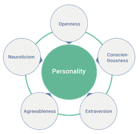

# Five Factor E Library 📦

![version 1.0.0][img_version]
![python 3.7 | 3.8 | 3.9 | 3.10][python_version]

[img_version]: https://img.shields.io/static/v1.svg?label=version&message=1.0.0&color=blue
[python_version]: https://img.shields.io/static/v1.svg?label=python&message=3.7%20|%203.8%20|%203.9%20|%203.10%20&color=blue

<p align="center">
  
</p>

This project assesses a person's :busts_in_silhouette: personality based on an inventory of questions. The project uses the Big Five theory using the [IPIP-NEO-120](http://www.personal.psu.edu/~j5j/IPIP/ipipneo120.htm) and [IPIP-NEO-300](http://www.personal.psu.edu/~j5j/IPIP/ipipneo300.htm) model developed by Professor **Dr. John A. Johnson**, this is free representation of [NEO PI-R™](https://en.wikipedia.org/wiki/Revised_NEO_Personality_Inventory).

*"The IPIP-NEO is not identical to the original NEO PI-R, but in my opinion it is close enough to serve as a good substitute. More and more people are beginning to use it in published research, so its acceptance is growing."* - Dr. Johnson

The main idea of the project is to facilitate the use of **Python** developers who want to use **IPIP-NEO** in their projects. *The project is also done in pure Python, it doesn't have any dependencies on other libraries*.

### Synopsis 🌐

A little theory, the The Big Five or Five Factor is made up of **5** great human personalities also known as the *O.C.E.A.N*. Are they:

 * Openness
 * Conscientiousness
 * Extraversion
 * Agreeableness
 * Neuroticism

To compose each great personality there are **6** traits or facets, totaling **30** traits. The user must answer a questionnaire of 120 or 300 single-choice questions. The user must answer an inventory of questions where each answer can have a unique and mandatory choice with **5** options:

* Very Inaccurate
* Moderately Inaccurate
* Neither Accurate Nor Inaccurate
* Moderately Accurate
* Very Accurate

For more information to demystify the Big Five, please see the article: [Measuring the Big Five Personality Domains](https://pages.uoregon.edu/sanjay/bigfive.html#norms)

### Installation 🚀

The simplest way is to use **PIP**, like the command:

```shell
$ pip install five-factor-e
```

### How to use 🔥

Add examples...

### Unit tests 🏗

Add examples...

```shell
$ ./run-test
```

### Credits 🙋

Add examples...

### Authors 👨‍💻

  * [Ederson Corbari](mailto:e@neural7.io)
  * [Marcos Ferretti](mailto:m@neural7.io)
